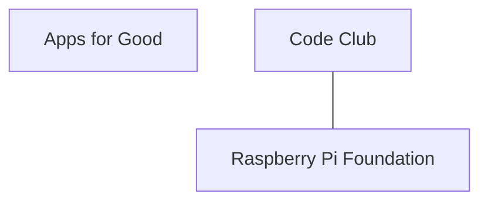
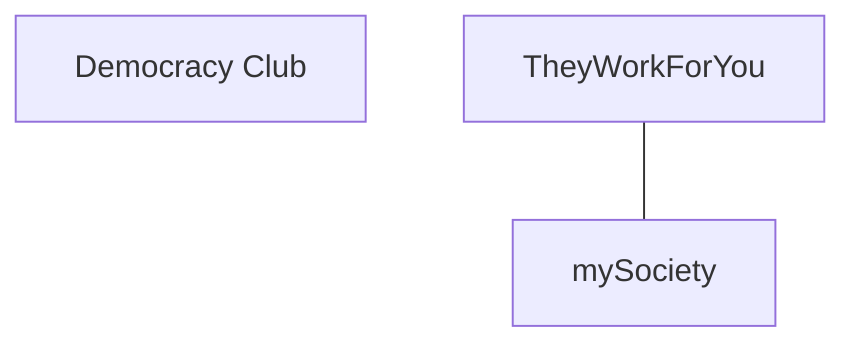

# UK Tech-for-Good Guide

This is a living directory of UK organisations, projects, networks, and people who use technology for public good: open data, civic tech, climate tech, accessibility, digital inclusion, humanitarian response, and more.

**Who this is for:** people looking for UK tech-for-good groups to work with, volunteer with, learn from, or connect to each other.

**How this guide is built:** it's generated from the YAML entries in `data/entries/`. Accuracy comes first: an entry is only added once its website (or another reliable source) confirms the details. This is a work in progress. It will grow, and some links or details may go out of date over time. See [CONTRIBUTING.md](CONTRIBUTING.md) to add or fix an entry.

## How to read this

Entries are grouped by **domain**: the area of public good the organisation works in. Each entry is a short, plain-language block: what the organisation does, where it's based, its links, and its tags. Where two entries are linked (for example, one runs on another's data, or they grew out of the same network), that connection is shown as a line in the diagrams below. No connection is invented: a line only appears if it's recorded in the underlying data.

**Legend: domains in this guide**

- **Open Data** (open-data): 8 entries
- **Education Equity Tech** (education equity tech): 3 entries
- **Human Rights Tech** (human-rights tech): 4 entries
- **Legal Aid & Justice Tech** (legal-aid / justice tech): 1 entry
- **Worker & Platform Co-ops** (worker-coop / platform-coop tech): 1 entry
- **Housing & Homelessness Tech** (housing / homelessness tech): 3 entries
- **Civic Tech** (civic-tech): 3 entries
- **Journalism & Media Tech** (journalism / media-tech): 1 entry
- **Digital Inclusion** (digital-inclusion): 1 entry
- **GovTech** (govtech): 2 entries
- **Green & Climate Tech** (green / climate-tech): 3 entries
- **Research & Education Tech** (research / education tech): 1 entry
- **Disability & Accessibility Tech** (disability & accessibility tech): 2 entries
- **Financial Inclusion & Fintech for Good** (financial-inclusion / fintech-for-good): 1 entry

**Total entries: 34, across 14 domains.**

## Ecosystem overview

This diagram shows the domains as nodes, sized by how many entries each holds, with a line drawn between two domains whenever at least one entry in one domain lists an entry in the other as related. Domains with no cross-domain links are shown on their own.

### Domain close-ups

The domains below have enough internal connections to be worth zooming in on. Isolated entries (no recorded links) are included as standalone nodes so the diagram still shows the whole domain.

**Education Equity Tech**

**Civic Tech**

## Open Data

Government or organisational data published for anyone to use, and the platforms that host and serve it.

_8 entries in this domain._

**360Giving**

- 360Giving is a charity that helps grantmakers publish and use open data about their funding, so people can see who is funding what and where.
- Region: national
- Links: [Website](https://www.threesixtygiving.org)
- Tags: grants, open data, philanthropy, transparency

**Centre for Public Data**

- The Centre for Public Data works to improve the UK's public data. It campaigns to fill gaps in data collection and to strengthen data provisions in new legislation.
- Region: national
- Links: [Website](https://www.centreforpublicdata.org)
- Tags: public data, policy, campaigning, legislation

**data.gov.uk**

- data.gov.uk is the UK government's home for public data. It brings datasets published by departments and public bodies together in one catalogue that anyone can search and download from.
- Region: national
- Links: [Website](https://www.data.gov.uk)
- Tags: open data, government, catalogue, datasets

**Office for National Statistics**

- The Office for National Statistics is the UK's national statistical institute and its largest independent producer of official statistics. It publishes data on the population, the economy, and society.
- Region: national
- Links: [Website](https://www.ons.gov.uk)
- Tags: official statistics, open data, government, population

**Open Data Institute**

- The Open Data Institute is a London-based non-profit founded in 2012 by Tim Berners-Lee and Nigel Shadbolt. It researches how data is collected and used, and advises organisations on doing that openly and accountably.
- Region: london
- Links: [Website](https://theodi.org)
- Tags: open data, research, policy, data ethics

**Open Data Manchester**

- Open Data Manchester helps people, organisations, and communities use data better, through advice, advocacy, events, research, and training.
- Region: north-west
- Links: [Website](https://www.opendatamanchester.org.uk)
- Tags: open data, training, community, greater manchester

**Open Innovations**

- Open Innovations is a not-for-profit in Leeds that works in the open with sponsors and partners to turn open data into tools and evidence for better decisions.
- Region: yorkshire-and-the-humber
- Links: [Website](https://open-innovations.org)
- Tags: open data, leeds, visualisation, innovation

**OpenUK**

- OpenUK is a not-for-profit and the UK body for the business of open technology, covering open source software, open hardware, open data, and open standards.
- Region: national
- Links: [Website](https://openuk.uk)
- Tags: open source, open standards, open data, advocacy

## Education Equity Tech

Tech that closes gaps in education: devices, coding programmes, and digital skills training for learners who wouldn't otherwise get them.

_3 entries in this domain._

**Apps for Good**

- Apps for Good provides free creative technology courses that teachers can run in the classroom, aimed at preparing students for a changing world of work.
- Region: national
- Links: [Website](https://www.appsforgood.org)
- Tags: education, courses, young people, digital skills

**Code Club**

- Code Club is a global community of free clubs where young people learn programming and digital making. It is part of the Raspberry Pi Foundation and provides projects and training for the volunteers who run clubs.
- Region: national
- Links: [Website](https://codeclub.org)
- Tags: coding, clubs, young people, volunteers
- Related: Raspberry Pi Foundation

**Raspberry Pi Foundation**

- The Raspberry Pi Foundation is a charity with a mission to help young people realise their potential through computing and digital technologies. It publishes free learning resources and supports clubs and teachers.
- Region: national
- Links: [Website](https://www.raspberrypi.org)
- Tags: computing, education, young people, charity

## Human Rights Tech

Digital campaigning, advocacy, and organising tools used to defend and advance human rights.

_4 entries in this domain._

**Big Brother Watch**

- Big Brother Watch campaigns against threats to privacy and civil liberties in the UK, including state surveillance and the collection of personal data.
- Region: national
- Links: [Website](https://bigbrotherwatch.org.uk)
- Tags: privacy, civil liberties, surveillance, campaigning

**Liberty**

- Liberty is a UK civil liberties organisation. It campaigns and takes legal cases on rights issues, including those raised by surveillance and the use of personal data.
- Region: national
- Links: [Website](https://www.libertyhumanrights.org.uk)
- Tags: civil liberties, human rights, litigation, campaigning

**Open Rights Group**

- Open Rights Group is a UK campaigning organisation working on digital rights. It focuses on privacy and free speech online, and on how data and technology affect people's rights.
- Region: national
- Links: [Website](https://www.openrightsgroup.org)
- Tags: digital rights, privacy, free speech, campaigning

**Privacy International**

- Privacy International is a charity based in London that works on the intersection of modern technology and human rights, with a focus on surveillance and the exploitation of personal data.
- Region: london
- Links: [Website](https://privacyinternational.org)
- Tags: privacy, surveillance, human rights, research

## Legal Aid & Justice Tech

Free or low-cost legal information and tools that help people understand and exercise their legal rights without a lawyer.

_1 entry in this domain._

**Citizens Advice**

- Citizens Advice gives free, independent advice on benefits, debt, housing, employment, and consumer problems. The advice is published on its website and delivered by advisers in local offices across the UK.
- Region: national
- Links: [Website](https://www.citizensadvice.org.uk)
- Tags: advice, benefits, debt, legal

## Worker & Platform Co-ops

Technology built and owned cooperatively by the people who use or work on it, rather than by outside shareholders.

_1 entry in this domain._

**CoTech**

- CoTech is a network of worker-owned technology co-operatives in the UK. Its members build software and digital services, and cooperate on client work and shared infrastructure.
- Region: national
- Links: [Website](https://www.coops.tech)
- Tags: co-operatives, worker ownership, software, network

## Housing & Homelessness Tech

Tools and data systems that help people find housing, coordinate homelessness services, or understand their rights as tenants.

_3 entries in this domain._

**Crisis**

- Crisis is a national charity for people experiencing homelessness. It runs services for people who are homeless and campaigns for the policy changes needed to end homelessness.
- Region: national
- Links: [Website](https://www.crisis.org.uk)
- Tags: homelessness, housing, charity, campaigning

**Homeless Link**

- Homeless Link is the national membership charity for organisations working directly with people who become homeless in England. It works to improve those services and campaigns for policy change.
- Region: national
- Links: [Website](https://homelesslink.org.uk)
- Tags: homelessness, housing, membership, policy

**Shelter England**

- Shelter is a housing and homelessness charity in England. It advises people and families on their housing rights, challenges unfair housing practice, and campaigns for better housing policy.
- Region: national
- Links: [Website](https://england.shelter.org.uk)
- Tags: housing, homelessness, advice, campaigning

## Civic Tech

Tools that help people take part in how their communities and government work: petitions, submissions, participatory budgeting, and ways to hold decision-makers to account.

_3 entries in this domain._

**Democracy Club**

- Democracy Club produces election data for the UK. It runs a national polling station finder and a candidate database, and publishes the underlying data for others to reuse.
- Region: national
- Links: [Website](https://democracyclub.org.uk)
- Tags: elections, open data, civic tech, voting

**mySociety**

- mySociety provides technology, research, and data that help people take part in civic life. Its tools, among them FixMyStreet and TheyWorkForYou, are used in more than 40 countries.
- Region: national
- Links: [Website](https://www.mysociety.org)
- Tags: civic tech, democracy, research, open source

**TheyWorkForYou**

- TheyWorkForYou, run by mySociety, makes the UK's parliaments easier to follow. You can look up who represents you and see how they have voted and what they have said in debates.
- Region: national
- Links: [Website](https://www.theyworkforyou.com)
- Tags: parliament, transparency, civic tech, hansard
- Related: mySociety

## Journalism & Media Tech

Public-interest journalism and the platforms or funding that support independent, accountable reporting.

_1 entry in this domain._

**Full Fact**

- Full Fact checks claims made online and in the news, and works with platforms, regulators, and researchers to reduce the harm caused by bad information.
- Region: national
- Links: [Website](https://fullfact.org)
- Tags: fact checking, misinformation, journalism, research

## Digital Inclusion

Helping people who are shut out of the digital world get online, get devices, and build the skills and confidence to use them.

_1 entry in this domain._

**Good Things Foundation**

- Good Things Foundation is a UK digital inclusion charity. It works with a network of local partners to help people get online, get hold of devices, and build the skills and confidence to use them.
- Region: national
- Links: [Website](https://www.goodthingsfoundation.org)
- Tags: digital inclusion, digital skills, devices, charity

## GovTech

Software and data services built for or by government agencies, used to run public services or open government data to the public.

_2 entries in this domain._

**Government Digital Service**

- The Government Digital Service is the digital centre of government. It builds and sets standards for UK public services online, including GOV.UK itself.
- Region: national
- Links: [Website](https://www.gov.uk/government/organisations/government-digital-service)
- Tags: govtech, public services, standards, digital government

**LocalGov Digital**

- LocalGov Digital is a network for digital practitioners working in and around local government, providing a place for councils to share work on common problems.
- Region: national
- Links: [Website](https://localgov.digital)
- Tags: local government, govtech, network, councils

## Green & Climate Tech

Tools that measure, reduce, or help people respond to climate change and its effects, from carbon tracking to clean-energy platforms.

_3 entries in this domain._

**Green Web Foundation**

- The Green Web Foundation works towards a fossil-free internet. It runs a check and a hosting directory that show whether a website is served using green energy, and publishes the dataset behind them.
- Region: national
- Links: [Website](https://www.thegreenwebfoundation.org)
- Tags: climate, green hosting, dataset, internet

**Open Climate Fix**

- Open Climate Fix builds open forecasting tools, mostly using machine learning, to help electricity grids plan around renewable generation and cut carbon emissions.
- Region: national
- Links: [Website](https://openclimatefix.org)
- Tags: climate, machine learning, forecasting, energy

**The Restart Project**

- The Restart Project helps people use their electronics for longer, which keeps working devices out of waste. It supports community repair events and campaigns for the right to repair.
- Region: national
- Links: [Website](https://therestartproject.org)
- Tags: right to repair, electronics, waste, community

## Research & Education Tech

Research institutions and platforms studying or supporting technology's role in society, and education programmes about it.

_1 entry in this domain._

**OpenSAFELY**

- OpenSAFELY is a platform for analysing large, sensitive datasets safely and securely. It is built by a team at the Bennett Institute so that approved researchers can work with NHS data under tight controls.
- Region: national
- Links: [Website](https://www.opensafely.org)
- Tags: health data, research, privacy, open source

## Disability & Accessibility Tech

Tools and consultancy that make websites, services, and physical spaces usable by disabled people, and organisations advocating for that.

_2 entries in this domain._

**RNIB**

- The Royal National Institute of Blind People supports blind and partially sighted people across the UK. It advises on assistive and accessible technology, and campaigns for accessible products and services.
- Region: national
- Links: [Website](https://www.rnib.org.uk)
- Tags: accessibility, blindness, assistive technology, charity

**Scope**

- Scope is a disability equality charity in England and Wales. It provides practical information and campaigns on the barriers disabled people face, including in digital services.
- Region: national
- Links: [Website](https://www.scope.org.uk)
- Tags: disability, equality, accessibility, charity

## Financial Inclusion & Fintech for Good

Tools that help people who are excluded from mainstream banking manage money, build savings, or access fair credit.

_1 entry in this domain._

**Turn2us**

- Turn2us is a charity that helps people facing financial insecurity. It runs online tools to check benefit entitlement and to search for charitable grants.
- Region: national
- Links: [Website](https://www.turn2us.org.uk)
- Tags: financial insecurity, benefits, grants, charity

## How this is maintained / how to add an entry

This guide is generated from the YAML files in `data/entries/`, one file per entry. See [CONTRIBUTING.md](CONTRIBUTING.md) for the full step-by-step walkthrough. In short:

1. Copy `data/entry.template.yaml` to `data/entries/<slug>.yaml`.
2. Fill in the fields, verifying each against a live source.
3. Run `python3 scripts/validate.py` to check it against the schema.
4. Run `python3 scripts/build_guide.py` to regenerate this file, then open a pull request.

Entries are only added once verified against a live source. If you spot something out of date, check the entry's `source` field first, then update the YAML file in `data/entries/`.

